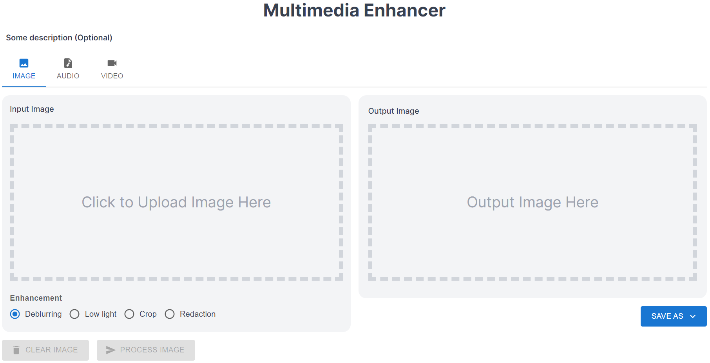

<h1 align="center">Multimedia Forensics Toolkit</h1>

## Description
Multimedia Forensics Toolkit is a tool used to streamline work processes and enhance investigative efforts by providing Digital-Forensics-as-a-Service (DFaaS). One of such use case would be for multimedia enhancement purposes such as deblurring and low light enhancement. Common operations on images include cropping, redaction (blurring regions of interest). 

## 🛠️&nbsp;Tools Used For This Project

## License

Licensed under the Apache License, Version 2.0 (the "License");
you may not use this file except in compliance with the License.
You may obtain a copy of the License at 

http://www.apache.org/licenses/LICENSE-2.0

Unless required by applicable law or agreed to in writing, software
distributed under the License is distributed on an "AS IS" BASIS,
WITHOUT WARRANTIES OR CONDITIONS OF ANY KIND, either express or implied.
See the License for the specific language governing permissions and
limitations under the License.